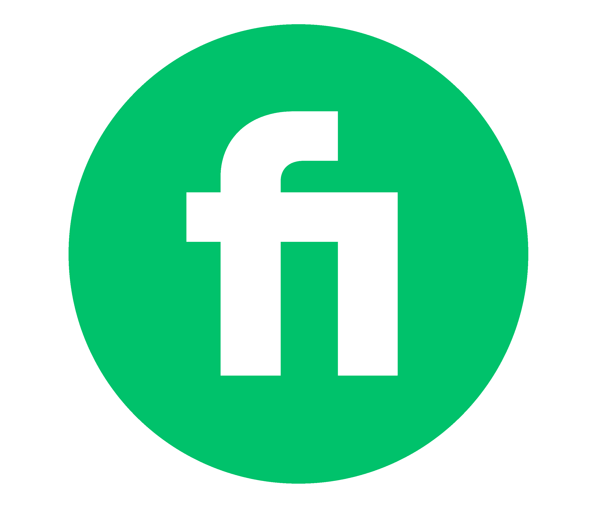

<!-- this README is inspired by the great efforts of Umer Ahmad. Shot out to him -->
<!-- His Github Profile: https://github.com/imumer16 -->

<!-- Profile Widget -->
<!-- reference = https://github.com/Jurredr/github-widgetbox -->

<!-- -------------- -->

<!-- Typing Widget -->
<!-- reference = https://github.com/DenverCoder1/readme-typing-svg -->

  

<!-- ------------- -->

<!-- Bio -->

  <h4 width=50%>
  I am a Full-Stack Software Engineer with expertise around web-based technologies like Reactjs, Nextjs, and Nodejs. I also do backend development in Python mainly Fastapi. I am a Level 1 Seller on Fiverr and Rising Talent on Upwork. I aim to build applications that are scalable, performant, and reach potential clients. I keep learning, continue equipping myself with new skills, and sharpening my existing skills. I prefer to challenge myself and do interesting things that matter.
  </h4>

<!-- Social icons section -->
 

  
  &#8287;&#8287;&#8287;&#8287;&#8287;
  
  &#8287;&#8287;&#8287;&#8287;&#8287;
  
  &#8287;&#8287;&#8287;&#8287;&#8287;
  

<!-- quote -->
<!-- reference = https://github.com/PiyushSuthar/github-readme-quotes -->
 

 

  

<!-- SVG typing for tech stack -->
<!-- reference = https://github.com/DenverCoder1/readme-typing-svg -->
 

	
 

  

<!-- tech stack -->
<!-- reference = https://github.com/tandpfun/skill-icons -->
 

  

 
